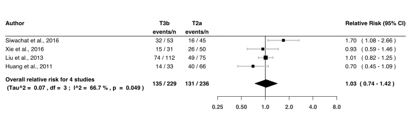

Thymectomy
================
Oscar Ponce & Andrea Solis-Pazmino
5/7/2020

## R Packages

`metafor`:[package](http://www.metafor-project.org/doku.php) used to
perform the analysis

`forestplot`:[package](https://cran.r-project.org/web/packages/forestplot/forestplot.pdf)
used to create forest plots

## Analysis codes

> [Click here to view our full script available as `R Markdown`
> file](https://github.com/ponceoscarj/Thymectomy/blob/master/Thymectomy_results.Rmd)

## Raw data

> [Click here to view our raw data available as `.CSV`
> file](https://github.com/ponceoscarj/Thymectomy/blob/master/Thymectomy_results.Rmd)

## Summary of forest plots

**Figure 1** - Summary of forest plots of the risk of achieving Complete
Stable Remission in patients with myasthenia gravis who underwent
**Transsternal thymectomy** vs. those who underwent **Transsternal or
Transcervical thymectomy** at different follow-ups
<!-- -->

**Figure 2** - Summary of forest plots of the risk of achieving Complete
Stable Remission in patients with myasthenia gravis who underwent a
**Transsternal Thymectomy** vs. those who underwent a **Minimally
Invasive Thymectomy** at different follow-ups\*\*
<!-- -->

**Figure 3** - Summary of forest plots of the risk of achieving Complete
Stable Remission in patients with myasthenia gravis who underwent a
**Minimally Invasive Thymectomy** those who underwent another
**Minimally Invasive Thymectomy** at different follow-ups\*\*
<!-- -->

## Supplementary Figures

### T-3b vs. T-3a forest plots

 Suppl. Figure 1: T-3b vs. T-3a, risk of CSR at 3 years of
follow-up 

<!-- -->

 Suppl. Figure 2: T-3b vs. T-3a, risk of CSR at 4 years of
follow-up 

<!-- -->

 Suppl. Figure 3: T-3b vs. T-3a, risk of CSR at 4 years of
follow-up 

<!-- -->

### T-3b vs. T-2a forest plots

 Suppl. Figure 4: T-3b vs. T-2a, risk of CSR at 3 years of
follow-up 

<!-- -->

 Suppl. Figure 5: T-3b vs. T-2a, risk of CSR at 4 years of
follow-up 

<!-- -->

 Suppl. Figure 6: T-3b vs. T-2a, risk of CSR at 5 years of
follow-up 

<!-- -->

 Suppl. Figure 7: T-3b vs. T-2a, risk of CSR at 6 years of
follow-up 

<!-- -->

 Suppl. Figure 8: T-3b vs. T-2a, risk of CSR at 7 years of
follow-up 

<!-- -->

 Suppl. Figure 9: T-3b vs. T-2a, risk of CSR at 8 years of
follow-up 

<!-- -->

