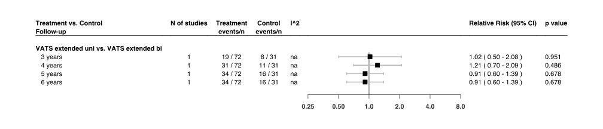
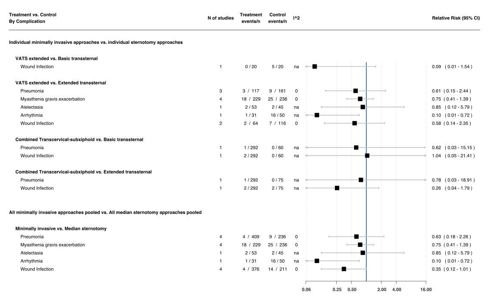
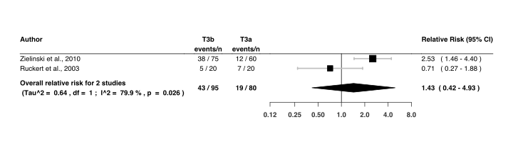
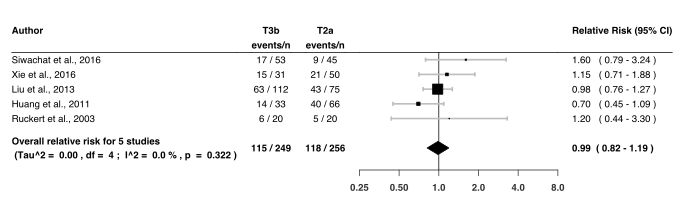

Thymectomy
================
Oscar J. Ponce & Andrea Solis-Pazmino
5/7/2020

The following documents should not be viewed without reading the
article, especially the graphs and tables. The article will clarify how
to use all the information available in this site.

## Open Data

> Click any of the following links to view the documents

|        Stage        |                                                                                                                             File                                                                                                                              |
| :-----------------: | :-----------------------------------------------------------------------------------------------------------------------------------------------------------------------------------------------------------------------------------------------------------: |
|      Protocol       |                                                                                      [Prospero](https://www.crd.york.ac.uk/prospero/display_record.php?RecordID=166827)                                                                                       |
|   Search strategy   | `Shown below` (Available to download as `.CSV`: [OVID](https://github.com/ponceoscarj/Thymectomy/blob/master/1%20Search%20strategy/ovid_search.csv), [Scopus](https://github.com/ponceoscarj/Thymectomy/blob/master/1%20Search%20strategy/scopus_search.csv)) |
| Abstract screening  |                                                [References used in this stage or search results](https://github.com/ponceoscarj/Thymectomy/blob/master/Screening_results/articles_for_abstract_screening.txt)                                                 |
| Full-text screening |                                                         [References used in this stage](https://github.com/ponceoscarj/Thymectomy/blob/master/Screening_results/articles_for_fulltext_screening.txt)                                                          |
|  Included studies   |                                                             [References used for data extraction](https://github.com/ponceoscarj/Thymectomy/blob/master/Screening_results/included_articles.txt)                                                              |
|  Raw Outcome data   |                                                                           [Available as `.CSV`](https://github.com/ponceoscarj/Thymectomy/blob/master/Data/thymectomy_outcomes.csv)                                                                           |
|   Analysis codes    |                                                                            [Script as `R Markdown`](https://github.com/ponceoscarj/Thymectomy/blob/master/Thymectomy_results.Rmd)                                                                             |

## Search strategy

Show OVID search

<!-- -->

Show SCOPUS search

<!-- -->

## Flow chart

### Figure 1

Show

## Summary of forest plots

### Figure 2

Click to show

*Risk of achieving Complete Stable Remission in patients with myasthenia
gravis who underwent* ***Extended transsternal thymectomy*** *vs.*
***Transsternal thymectomy*** *at different follow-ups*

<!-- -->

> To generate this forest plot, we used information from Supplementary
> Figures 1 to 3.

### Figure 3

Click to show

*Risk of achieving Complete Stable Remission in patients with myasthenia
gravis who underwent* ***Transsternal Thymectomy*** *vs.* ***Minimally
Invasive Thymectomy*** *at different follow-ups*
<!-- -->

> To generate this forest plot, we used information from Supplementary
> Figures 4 to 9.

### Figure 4

Click to show

*Risk of achieving Complete Stable Remission in patients with myasthenia
gravis who underwent* ***different types of minimally invasive
thymectomy*** *at different follow-ups*

<!-- -->

### Figure 5

Click to show

*Risk of achieving Complete Stable Remission in patients with myasthenia
gravis who underwent* ***VATS extended unilateral*** *vs. those who
underwent* ***VATS extended bilateral*** *thymectomy at different
follow-ups*

<!-- -->

### Figure 6

Click to show

*Risk of complications in patients with myasthenia gravis*
<!-- -->

## Supplementary Figures

### Extended Transsternal vs. Basic Transsternal forest plots

 Suppl. Figure 1: Extended Transsternal vs. Basic Transsternal,
risk of CSR at 3 years of follow-up 

<!-- -->

 Suppl. Figure 2: Extended Transsternal vs. Basic Transsternal,
risk of CSR at 4 years of follow-up 

<!-- -->

 Suppl. Figure 3: Extended Transsternal vs. Basic Transsternal,
risk of CSR at 4 years of follow-up 

<!-- -->

### Extended Transsternal vs. VATS extended forest plots

 Suppl. Figure 4: Extended Transsternal vs. VATS extended, risk
of CSR at 3 years of follow-up 

<!-- -->

 Suppl. Figure 5: Extended Transsternal vs. VATS extended, risk
of CSR at 4 years of follow-up 

<!-- -->

 Suppl. Figure 6: Extended Transsternal vs. VATS extended, risk
of CSR at 5 years of follow-up 

<!-- -->

 Suppl. Figure 7: Extended Transsternal vs. VATS extended, risk
of CSR at 6 years of follow-up 

<!-- -->

 Suppl. Figure 8: Extended Transsternal vs. VATS extended, risk
of CSR at 7 years of follow-up 

<!-- -->

 Suppl. Figure 9: Extended Transsternal vs. VATS extended, risk
of CSR at 8 years of follow-up 

<!-- -->

