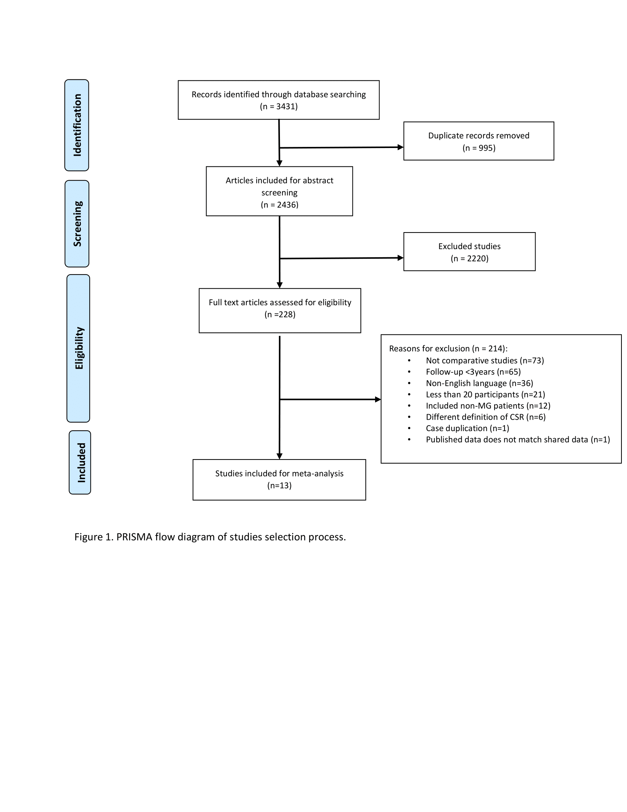

Thymectomy
================
Oscar J. Ponce & Andrea Solis-Pazmino
5/7/2020

The following documents should not be viewed without reading the
article, especially the graphs and tables. The article will clarify how
to use all the information available in this site.

## Open Data

> Click any of the following links to view the documents

|        Stage        |                                                                                                                             File                                                                                                                              |
| :-----------------: | :-----------------------------------------------------------------------------------------------------------------------------------------------------------------------------------------------------------------------------------------------------------: |
|      Protocol       |                                                                                      [Prospero](https://www.crd.york.ac.uk/prospero/display_record.php?RecordID=166827)                                                                                       |
|   Search strategy   | `Shown below` (Available to download as `.CSV`: [OVID](https://github.com/ponceoscarj/Thymectomy/blob/master/1%20Search%20strategy/ovid_search.csv), [Scopus](https://github.com/ponceoscarj/Thymectomy/blob/master/1%20Search%20strategy/scopus_search.csv)) |
| Abstract screening  |                                                [References used in this stage or search results](https://github.com/ponceoscarj/Thymectomy/blob/master/Screening_results/articles_for_abstract_screening.txt)                                                 |
| Full-text screening |                                                         [References used in this stage](https://github.com/ponceoscarj/Thymectomy/blob/master/Screening_results/articles_for_fulltext_screening.txt)                                                          |
|  Included studies   |                                                             [References used for data extraction](https://github.com/ponceoscarj/Thymectomy/blob/master/Screening_results/included_articles.txt)                                                              |
|  Raw Outcome data   |                                                                           [Available as `.CSV`](https://github.com/ponceoscarj/Thymectomy/blob/master/Data/thymectomy_outcomes.csv)                                                                           |
|   Analysis codes    |                                                                            [Script as `R Markdown`](https://github.com/ponceoscarj/Thymectomy/blob/master/Thymectomy_results.Rmd)                                                                             |

## Search strategy

Show OVID search

<!--html_preserve-->

<table class="gt_table">

<thead class="gt_header">

<tr>

<th colspan="2" class="gt_heading gt_title gt_font_normal" style>

<strong>Ovid Search</strong>

</th>

</tr>

<tr>

<th colspan="2" class="gt_heading gt_subtitle gt_font_normal gt_bottom_border" style>

Databases: EBM Reviews - Cochrane Central Register of Controlled Trials
April 2019, EBM Reviews - Cochrane Database of Systematic Reviews 2005
to May 2, 2019, Embase 1974 to 2019 May 03, Ovid MEDLINE(R) and Epub
Ahead of Print, In-Process & Other Non-Indexed Citations and Daily 1946
to May 03, 2019

</th>

</tr>

</thead>

<thead class="gt_col_headings">

<tr>

<th class="gt_col_heading gt_columns_bottom_border gt_left" rowspan="1" colspan="1">

<strong>Search   line</strong>

</th>

<th class="gt_col_heading gt_columns_bottom_border gt_left" rowspan="1" colspan="1">

<strong>Search   terms</strong>

</th>

</tr>

</thead>

<tbody class="gt_table_body">

<tr>

<td class="gt_row gt_left">

1

</td>

<td class="gt_row gt_left">

exp Myasthenia Gravis/

</td>

</tr>

<tr>

<td class="gt_row gt_left">

2

</td>

<td class="gt_row gt_left">

(“erb goldflam disease” or “myasthenia gravis”).ti,ab,hw,kw.

</td>

</tr>

<tr>

<td class="gt_row gt_left">

3

</td>

<td class="gt_row gt_left">

1 or 2

</td>

</tr>

<tr>

<td class="gt_row gt_left">

4

</td>

<td class="gt_row gt_left">

exp Thymectomy/

</td>

</tr>

<tr>

<td class="gt_row gt_left">

5

</td>

<td class="gt_row gt_left">

((thymus adj3 (extirpation\* or remov*)) or thymectom* or
thymectomia\*).ti,ab,hw,kw.

</td>

</tr>

<tr>

<td class="gt_row gt_left">

6

</td>

<td class="gt_row gt_left">

4 or 5

</td>

</tr>

<tr>

<td class="gt_row gt_left">

7

</td>

<td class="gt_row gt_left">

3 and 6

</td>

</tr>

<tr>

<td class="gt_row gt_left">

8

</td>

<td class="gt_row gt_left">

exp meta analysis/

</td>

</tr>

<tr>

<td class="gt_row gt_left">

9

</td>

<td class="gt_row gt_left">

exp Meta-Analysis as Topic/

</td>

</tr>

<tr>

<td class="gt_row gt_left">

10

</td>

<td class="gt_row gt_left">

exp “systematic review”/

</td>

</tr>

<tr>

<td class="gt_row gt_left">

11

</td>

<td class="gt_row gt_left">

exp controlled study/

</td>

</tr>

<tr>

<td class="gt_row gt_left">

12

</td>

<td class="gt_row gt_left">

exp Randomized Controlled Trial/

</td>

</tr>

<tr>

<td class="gt_row gt_left">

13

</td>

<td class="gt_row gt_left">

exp triple blind procedure/

</td>

</tr>

<tr>

<td class="gt_row gt_left">

14

</td>

<td class="gt_row gt_left">

exp Double-Blind Method/

</td>

</tr>

<tr>

<td class="gt_row gt_left">

15

</td>

<td class="gt_row gt_left">

exp Single-Blind Method/

</td>

</tr>

<tr>

<td class="gt_row gt_left">

16

</td>

<td class="gt_row gt_left">

exp latin square design/

</td>

</tr>

<tr>

<td class="gt_row gt_left">

17

</td>

<td class="gt_row gt_left">

exp Placebos/

</td>

</tr>

<tr>

<td class="gt_row gt_left">

18

</td>

<td class="gt_row gt_left">

exp Placebo Effect/

</td>

</tr>

<tr>

<td class="gt_row gt_left">

19

</td>

<td class="gt_row gt_left">

exp comparative study/

</td>

</tr>

<tr>

<td class="gt_row gt_left">

20

</td>

<td class="gt_row gt_left">

exp intervention studies/

</td>

</tr>

<tr>

<td class="gt_row gt_left">

21

</td>

<td class="gt_row gt_left">

exp Cross-Sectional Studies/

</td>

</tr>

<tr>

<td class="gt_row gt_left">

22

</td>

<td class="gt_row gt_left">

exp Cohort Studies/

</td>

</tr>

<tr>

<td class="gt_row gt_left">

23

</td>

<td class="gt_row gt_left">

exp longitudinal study/

</td>

</tr>

<tr>

<td class="gt_row gt_left">

24

</td>

<td class="gt_row gt_left">

exp retrospective study/

</td>

</tr>

<tr>

<td class="gt_row gt_left">

25

</td>

<td class="gt_row gt_left">

exp prospective study/

</td>

</tr>

<tr>

<td class="gt_row gt_left">

26

</td>

<td class="gt_row gt_left">

exp observational study/

</td>

</tr>

<tr>

<td class="gt_row gt_left">

27

</td>

<td class="gt_row gt_left">

exp clinical trial/

</td>

</tr>

<tr>

<td class="gt_row gt_left">

28

</td>

<td class="gt_row gt_left">

clinical study/

</td>

</tr>

<tr>

<td class="gt_row gt_left">

29

</td>

<td class="gt_row gt_left">

exp Evaluation Studies/

</td>

</tr>

<tr>

<td class="gt_row gt_left">

30

</td>

<td class="gt_row gt_left">

exp Evaluation Studies as Topic/

</td>

</tr>

<tr>

<td class="gt_row gt_left">

31

</td>

<td class="gt_row gt_left">

exp experimental study/

</td>

</tr>

<tr>

<td class="gt_row gt_left">

32

</td>

<td class="gt_row gt_left">

exp quasi experimental study/

</td>

</tr>

<tr>

<td class="gt_row gt_left">

33

</td>

<td class="gt_row gt_left">

exp case-control studies/

</td>

</tr>

<tr>

<td class="gt_row gt_left">

34

</td>

<td class="gt_row gt_left">

exp confidence interval/

</td>

</tr>

<tr>

<td class="gt_row gt_left">

35

</td>

<td class="gt_row gt_left">

exp regression analysis/

</td>

</tr>

<tr>

<td class="gt_row gt_left">

36

</td>

<td class="gt_row gt_left">

exp proportional hazards model/

</td>

</tr>

<tr>

<td class="gt_row gt_left">

37

</td>

<td class="gt_row gt_left">

exp multivariate analysis/

</td>

</tr>

<tr>

<td class="gt_row gt_left">

38

</td>

<td class="gt_row gt_left">

exp follow up studies/

</td>

</tr>

<tr>

<td class="gt_row gt_left">

39

</td>

<td class="gt_row gt_left">

((meta adj analys*) or metaanalys* or (systematic\* adj3 review*) or
(control* adj3 study) or (control\* adj3 trial) or (randomized adj3
study) or (randomized adj3 trial) or (randomised adj3 study) or
(randomised adj3 trial) or “pragmatic clinical trial” or (random\* adj1
allocat*) or (doubl* adj blind*) or (doubl* adj mask*) or (singl* adj
blind*) or (singl* adj mask*) or (tripl* adj blind*) or (tripl* adj
mask*) or (trebl* adj blind*) or (trebl* adj mask*) or “latin square” or
placebo* or nocebo\* or multivariate or “comparative study” or
“comparative survey” or “comparative analysis” or (intervention\* adj2
study) or (intervention\* adj2 trial) or “cross-sectional study” or
“cross-sectional analysis” or “cross-sectional survey” or
“cross-sectional design” or “prevalence study” or “prevalence
analysis” or “prevalence survey” or “disease frequency study” or
“disease frequency analysis” or “disease frequency survey” or cohort\*
or “longitudinal study” or “longitudinal survey” or “longitudinal
analysis” or “longitudinal evaluation” or longitudinal\* or
((retrospective or “ex post facto”) adj3 (study or survey or analysis or
design)) or retrospectiv\* or “prospective study” or “prospective
survey” or “prospective analysis” or prospectiv\* or ((“follow-up” or
followup) adj (stud\* or survey or analysis)) or ((observation or
observational) adj (study or survey or analysis)) or “case study” or
“case series” or “clinical series” or “case studies” or “clinical
study” or “clinical trial” or ((“phase 0” or “phase 1” or “phase I” or
“phase 2” or “phase II” or “phase 3” or “phase III” or “phase 4” or
“phase IV”) adj5 (trial or study)) or “evaluation study” or
“evaluation survey” or “evaluation analysis” or “experimental study”
or “experimental analysis” or “quasi experimental study” or “quasi
experimental analysis” or “quasiexperimental study” or
“quasiexperimental analysis” or ((correlation\* adj2 study) or
(correlation\* adj2 analys*)) or “case control study” or “case base
study” or “case referrent study” or “case referent study” or “case
referent study” or “case compeer study” or “case comparison study” or
“matched case control” or “multicenter study” or “multi-center study”
or “odds ratio” or “confidence interval” or “regression analysis” or
“least square” or “least squares” or (hazard* adj (model\* or analys\*
or regression or ratio or ratios)) or “Cox model” or “Cox multivariate
analyses” or “Cox multivariate analysis” or “Cox regression” or “Cox
survival analyses” or “Cox survival analysis” or “Cox survival model” or
“change analysis” or ((study or trial or random\* or control*) and
compar*)).mp,pt.

</td>

</tr>

<tr>

<td class="gt_row gt_left">

40

</td>

<td class="gt_row gt_left">

or/8-39

</td>

</tr>

<tr>

<td class="gt_row gt_left">

41

</td>

<td class="gt_row gt_left">

7 and 40

</td>

</tr>

<tr>

<td class="gt_row gt_left">

42

</td>

<td class="gt_row gt_left">

limit 41 to (“all adult (19 plus years)” or “young adult (19 to 24
years)” or “adult (19 to 44 years)” or “young adult and adult (19-24 and
19-44)” or “middle age (45 to 64 years)” or “middle aged (45 plus
years)” or “all aged (65 and over)” or “aged (80 and over)”) \[Limit
not valid in CCTR,CDSR,Embase; records were retained\]

</td>

</tr>

<tr>

<td class="gt_row gt_left">

43

</td>

<td class="gt_row gt_left">

limit 42 to (adult \<18 to 64 years\> or aged \<65+ years\>) \[Limit not
valid in CCTR,CDSR,Ovid MEDLINE(R),Ovid MEDLINE(R) Daily Update,Ovid
MEDLINE(R) In-Process,Ovid MEDLINE(R) Publisher; records were retained\]

</td>

</tr>

<tr>

<td class="gt_row gt_left">

44

</td>

<td class="gt_row gt_left">

limit 41 to (“all infant (birth to 23 months)” or “all child (0 to 18
years)” or “newborn infant (birth to 1 month)” or “infant (1 to 23
months)” or “preschool child (2 to 5 years)” or “child (6 to 12 years)”
or “adolescent (13 to 18 years)”) \[Limit not valid in CCTR,CDSR,Embase;
records were retained\]

</td>

</tr>

<tr>

<td class="gt_row gt_left">

45

</td>

<td class="gt_row gt_left">

limit 44 to (embryo or infant or child or preschool child \<1 to 6
years\> or school child \<7 to 12 years\> or adolescent \<13 to 17
years\>) \[Limit not valid in CCTR,CDSR,Ovid MEDLINE(R),Ovid MEDLINE(R)
Daily Update,Ovid MEDLINE(R) In-Process,Ovid MEDLINE(R) Publisher;
records were retained\]

</td>

</tr>

<tr>

<td class="gt_row gt_left">

46

</td>

<td class="gt_row gt_left">

45 not 43

</td>

</tr>

<tr>

<td class="gt_row gt_left">

47

</td>

<td class="gt_row gt_left">

41 not 46

</td>

</tr>

<tr>

<td class="gt_row gt_left">

48

</td>

<td class="gt_row gt_left">

limit 47 to (editorial or erratum or note or addresses or autobiography
or bibliography or biography or blogs or comment or dictionary or
directory or interactive tutorial or interview or lectures or legal
cases or legislation or news or newspaper article or overall or patient
education handout or periodical index or portraits or published erratum
or video-audio media or webcasts) \[Limit not valid in
CCTR,CDSR,Embase,Ovid MEDLINE(R),Ovid MEDLINE(R) Daily Update,Ovid
MEDLINE(R) In-Process,Ovid MEDLINE(R) Publisher; records were retained\]

</td>

</tr>

<tr>

<td class="gt_row gt_left">

49

</td>

<td class="gt_row gt_left">

from 48 keep 1-2

</td>

</tr>

<tr>

<td class="gt_row gt_left">

50

</td>

<td class="gt_row gt_left">

(47 not 48) or 49

</td>

</tr>

<tr>

<td class="gt_row gt_left">

51

</td>

<td class="gt_row gt_left">

remove duplicates from 50

</td>

</tr>

</tbody>

</table>

<!--/html_preserve-->

Show SCOPUS search

<!--html_preserve-->

<table class="gt_table">

<thead class="gt_header">

<tr>

<th colspan="2" class="gt_heading gt_title gt_font_normal" style>

<strong>Scopus Search</strong>

</th>

</tr>

<tr>

<th colspan="2" class="gt_heading gt_subtitle gt_font_normal gt_bottom_border" style>

</th>

</tr>

</thead>

<thead class="gt_col_headings">

<tr>

<th class="gt_col_heading gt_columns_bottom_border gt_left" rowspan="1" colspan="1">

<strong>Search   line</strong>

</th>

<th class="gt_col_heading gt_columns_bottom_border gt_left" rowspan="1" colspan="1">

<strong>Search   terms</strong>

</th>

</tr>

</thead>

<tbody class="gt_table_body">

<tr>

<td class="gt_row gt_left">

1

</td>

<td class="gt_row gt_left">

TITLE-ABS-KEY(“erb goldflam disease” OR “myasthenia gravis”)

</td>

</tr>

<tr>

<td class="gt_row gt_left">

2

</td>

<td class="gt_row gt_left">

TITLE-ABS-KEY((thymus W/3 (extirpation\* or remov*)) OR thymectom* OR
thymectomia\*)

</td>

</tr>

<tr>

<td class="gt_row gt_left">

3

</td>

<td class="gt_row gt_left">

TITLE-ABS-KEY((meta W/1 analys*) OR metaanalys* OR (systematic\* W/3
review*) OR (control* W/3 study) OR (control\* W/3 trial) OR (randomized
W/3 study) OR (randomized W/3 trial) OR (randomised W/3 study) OR
(randomised W/3 trial) OR “pragmatic clinical trial” OR (random\* W/1
allocat*) OR (doubl* W/1 blind*) OR (doubl* W/1 mask*) OR (singl* W/1
blind*) OR (singl* W/1 mask*) OR (tripl* W/1 blind*) OR (tripl* W/1
mask*) OR (trebl* W/1 blind*) OR (trebl* W/1 mask*) OR “latin square” OR
placebo* OR nocebo\* OR multivariate OR “comparative study” OR
“comparative survey” OR “comparative analysis” OR (intervention\* W/2
study) OR (intervention\* W/2 trial) OR “cross-sectional study” OR
“cross-sectional analysis” OR “cross-sectional survey” OR
“cross-sectional design” OR “prevalence study” OR “prevalence
analysis” OR “prevalence survey” OR “disease frequency study” OR
“disease frequency analysis” OR “disease frequency survey” OR cohort\*
OR “longitudinal study” OR “longitudinal survey” OR “longitudinal
analysis” OR “longitudinal evaluation” OR longitudinal\* OR
((retrospective OR “ex post facto”) W/3 (study OR survey OR analysis OR
design)) OR retrospectiv\* OR “prospective study” OR “prospective
survey” OR “prospective analysis” OR prospectiv\* OR ((“follow-up” or
followup) W/1 (stud\* or survey or analysis)) OR ((observation or
observational) W/1 (study or survey or analysis)) OR “case study” OR
“case series” OR “clinical series” OR “case studies” OR “clinical
study” OR “clinical trial” OR ((“phase 0” or “phase 1” or “phase I” or
“phase 2” or “phase II” or “phase 3” or “phase III” or “phase 4” or
“phase IV”) W/5 (trial or study)) OR “evaluation study” OR “evaluation
survey” OR “evaluation analysis” OR “experimental study” OR
“experimental analysis” OR “quasi experimental study” OR “quasi
experimental analysis” OR “quasiexperimental study” OR
“quasiexperimental analysis” OR ((correlation\* W/2 study) OR
(correlation\* W/2 analys*)) OR “case control study” OR “case base
study” OR “case referrent study” OR “case referent study” OR “case
referent study” OR “case compeer study” OR “case comparison study” OR
“matched case control” OR “multicenter study” OR “multi-center study”
OR “odds ratio” OR “confidence interval” OR “regression analysis” OR
“least square” OR “least squares” OR (hazard* W/1 (model\* OR analys\*
OR regression or ratio or ratios)) OR “Cox model” OR “Cox multivariate
analyses” OR “Cox multivariate analysis” OR “Cox regression” OR “Cox
survival analyses” OR “Cox survival analysis” OR “Cox survival model” OR
“change analysis” OR ((study OR trial OR random\* OR control*) AND
compar*))

</td>

</tr>

<tr>

<td class="gt_row gt_left">

4

</td>

<td class="gt_row gt_left">

1 and 2 and 3

</td>

</tr>

<tr>

<td class="gt_row gt_left">

5

</td>

<td class="gt_row gt_left">

TITLE-ABS-KEY(newborn\* or neonat\* or infant\* or toddler\* or child\*
or adolescent\* or paediatric\* or pediatric\* or girl or girls or boy
or boys or teen or teens or teenager\* or preschooler\* or
“pre-schooler*" or preteen or preteens or "pre-teen" or "pre-teens" or
youth or youths) AND NOT TITLE-ABS-KEY(adult or adults or "middle age"
or "middle aged" OR elderly OR geriatric* OR”old people" OR “old
person*" OR "older people" OR "older person*” OR “very old”)

</td>

</tr>

<tr>

<td class="gt_row gt_left">

6

</td>

<td class="gt_row gt_left">

4 and not 5

</td>

</tr>

<tr>

<td class="gt_row gt_left">

7

</td>

<td class="gt_row gt_left">

DOCTYPE(ed) OR DOCTYPE(bk) OR DOCTYPE(er) OR DOCTYPE(no) OR DOCTYPE(sh)

</td>

</tr>

<tr>

<td class="gt_row gt_left">

8

</td>

<td class="gt_row gt_left">

6 and not 7

</td>

</tr>

<tr>

<td class="gt_row gt_left">

9

</td>

<td class="gt_row gt_left">

INDEX(embase) OR INDEX(medline) OR PMID(0\* OR 1\* OR 2\* OR 3\* OR 4\*
OR 5\* OR 6\* OR 7\* OR 8\* OR 9\*)

</td>

</tr>

<tr>

<td class="gt_row gt_left">

10

</td>

<td class="gt_row gt_left">

8 and not 9

</td>

</tr>

</tbody>

</table>

<!--/html_preserve-->

## Flow chart

### Figure 1

Show

## Summary of forest plots

### Figure 2

Click to show

*Risk of achieving Complete Stable Remission in patients with myasthenia
gravis who underwent* ***Extended transsternal thymectomy*** *vs.*
***Transsternal thymectomy*** *at different follow-ups*

<!-- -->

> To generate this forest plot, we used information from Supplementary
> Figures 1 to 3.

### Figure 3

Click to show

*Risk of achieving Complete Stable Remission in patients with myasthenia
gravis who underwent* ***Transsternal Thymectomy*** *vs.* ***Minimally
Invasive Thymectomy*** *at different follow-ups*
<!-- -->

> To generate this forest plot, we used information from Supplementary
> Figures 4 to 9.

### Figure 4

Click to show

*Risk of achieving Complete Stable Remission in patients with myasthenia
gravis who underwent* ***different types of minimally invasive
thymectomy*** *at different follow-ups*

<!-- -->

### Figure 5

Click to show

*Risk of achieving Complete Stable Remission in patients with myasthenia
gravis who underwent* ***VATS extended unilateral*** *vs. those who
underwent* ***VATS extended bilateral*** *thymectomy at different
follow-ups*

<!-- -->

## Supplementary Figures

### Extended Transsternal vs. Standard Transsternal forest plots

 Suppl. Figure 1: Extended Transsternal vs. Standard
Transsternal, risk of CSR at 3 years of follow-up 

<!-- -->

 Suppl. Figure 2: Extended Transsternal vs. Standard
Transsternal, risk of CSR at 4 years of follow-up 

<!-- -->

 Suppl. Figure 3: Extended Transsternal vs. Standard
Transsternal, risk of CSR at 4 years of follow-up 

<!-- -->

### Extended Transsternal vs. VATS extended forest plots

 Suppl. Figure 4: Extended Transsternal vs. VATS extended, risk
of CSR at 3 years of follow-up 

<!-- -->

 Suppl. Figure 5: Extended Transsternal vs. VATS extended, risk
of CSR at 4 years of follow-up 

<!-- -->

 Suppl. Figure 6: Extended Transsternal vs. VATS extended, risk
of CSR at 5 years of follow-up 

<!-- -->

 Suppl. Figure 7: Extended Transsternal vs. VATS extended, risk
of CSR at 6 years of follow-up 

<!-- -->

 Suppl. Figure 8: Extended Transsternal vs. VATS extended, risk
of CSR at 7 years of follow-up 

<!-- -->

 Suppl. Figure 9: Extended Transsternal vs. VATS extended, risk
of CSR at 8 years of follow-up 

<!-- -->

