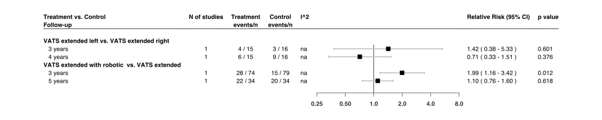
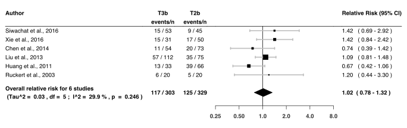

Thymectomy
================
Oscar Ponce & Andrea Solis-Pazmino
5/7/2020

## R Packages

`metafor`:[package](http://www.metafor-project.org/doku.php) used to
perform the analysis

`forestplot`:[package](https://cran.r-project.org/web/packages/forestplot/forestplot.pdf)
used to create forest plots

## Analysis codes

<details>

<summary>CLICK To View Main analysis codes</summary>

<p>

``` r
prema1 <- escalc(measure="RR",ai=events1, ci=events2, n1i=n1, n2i=n2,
                  subset=(followup==3 & 
                            comparison=="T3b  vs.  T3a"), data=pao)
prema1 <- summary(prema1)
prema1$rr <- paste(formatC((exp(prema1$yi)), format='f', digits=2), " ",
                    "(", formatC((exp(prema1$ci.lb)), format='f', digits=2), "-",
                    formatC((exp(prema1$ci.ub)), format='f', digits=2),")")
ma1 <- rma(measure="RR", yi,vi, data=prema1, method="REML")
expma1 <- predict(ma1, transf = transf.exp.int)


prema2 <- escalc(measure="RR",ai=events1, ci=events2, n1i=n1, n2i=n2,
                  subset=(followup==4 & 
                            comparison=="T3b  vs.  T3a"), data=pao)
prema2 <- summary(prema2)
prema2$rr <- paste(formatC((exp(prema2$yi)), format='f', digits=2), " ",
                    "(", formatC((exp(prema2$ci.lb)), format='f', digits=2), "-",
                    formatC((exp(prema2$ci.ub)), format='f', digits=2),")")
ma2 <- rma(measure="RR", yi,vi, data=prema2, method="REML")
expma2 <- predict(ma2, transf = transf.exp.int)


prema3 <- escalc(measure="RR",ai=events1, ci=events2, n1i=n1, n2i=n2,
                  subset=(followup==5 & 
                            comparison=="T3b  vs.  T3a"), data=pao)
prema3 <- summary(prema3)
prema3$rr <- paste(formatC((exp(prema3$yi)), format='f', digits=2), " ",
                    "(", formatC((exp(prema3$ci.lb)), format='f', digits=2), "-",
                    formatC((exp(prema3$ci.ub)), format='f', digits=2),")")
ma3 <- rma(measure="RR", yi,vi, data=prema3, method="REML")
expma3 <- predict(ma3, transf = transf.exp.int)


ma4 <- rma(measure="RR", ai=events1, ci=events2, n1i=n1, n2i=n2, 
            data=pao, subset=(followup==10 & comparison=="T3b  vs.  T1a"),
            method="REML")
expma4 <- predict(ma4, transf = exp, digits=2)


ma5 <- rma(measure="RR", ai=events1, ci=events2, n1i=n1, n2i=n2, 
           data=pao, subset=(followup==3 & comparison=="T3a  vs.  T2a"), 
           method="REML")
expma5 <- predict(ma5, transf = exp, digits=2)


ma6 <- rma(measure="RR", ai=events1, ci=events2, n1i=n1, n2i=n2, 
           data=pao, subset=(followup==4 & comparison=="T3a  vs.  T2a"), 
           method="REML")
expma6<- predict(ma6, transf = exp, digits=2)


ma7 <- rma(measure="RR", ai=events1, ci=events2, n1i=n1, n2i=n2, 
           data=pao, subset=(followup==5 & comparison=="T3a  vs.  T2a"),
           method="REML")
expma7 <- predict(ma7, transf = exp, digits=2)


prema8 <- escalc(measure="RR",ai=events1, ci=events2, n1i=n1, n2i=n2,
                  subset=(followup==3 & 
                            comparison=="T3b  vs.  T2a"), data=pao)
prema8 <- summary(prema8)
prema8$rr <- paste(formatC((exp(prema8$yi)), format='f', digits=2), " ",
                    "(", formatC((exp(prema8$ci.lb)), format='f', digits=2), "-",
                    formatC((exp(prema8$ci.ub)), format='f', digits=2),")")
ma8 <- rma(measure="RR", yi,vi, data=prema8, method="REML")
expma8 <- predict(ma8, transf = transf.exp.int)


prema9 <- escalc(measure="RR",ai=events1, ci=events2, n1i=n1, n2i=n2,
                  subset=(followup==4 & 
                            comparison=="T3b  vs.  T2a"), data=pao)
prema9 <- summary(prema9)
prema9$rr <- paste(formatC((exp(prema9$yi)), format='f', digits=2), " ",
                    "(", formatC((exp(prema9$ci.lb)), format='f', digits=2), "-",
                    formatC((exp(prema9$ci.ub)), format='f', digits=2),")")
ma9 <- rma(measure="RR", yi,vi, data=prema9, method="REML")
expma9 <- predict(ma9, transf = transf.exp.int)


prema10 <- escalc(measure="RR",ai=events1, ci=events2, n1i=n1, n2i=n2,
                  subset=(followup==5 & 
                            comparison=="T3b  vs.  T2a"), data=pao)
prema10 <- summary(prema10)
prema10$rr <- paste(formatC((exp(prema10$yi)), format='f', digits=2), " ",
                    "(", formatC((exp(prema10$ci.lb)), format='f', digits=2), "-",
                    formatC((exp(prema10$ci.ub)), format='f', digits=2),")")
ma10 <- rma(measure="RR", yi,vi, data=prema10, method="REML")
expma10 <- predict(ma10, transf = transf.exp.int)


prema11 <- escalc(measure="RR",ai=events1, ci=events2, n1i=n1, n2i=n2,
                  subset=(followup==6 & 
                            comparison=="T3b  vs.  T2a"), data=pao)
prema11 <- summary(prema11)
prema11$rr <- paste(formatC((exp(prema11$yi)), format='f', digits=2), " ",
                    "(", formatC((exp(prema11$ci.lb)), format='f', digits=2), "-",
                    formatC((exp(prema11$ci.ub)), format='f', digits=2),")")
ma11 <- rma(measure="RR", yi,vi, data=prema11, method="REML")
expma11 <- predict(ma11, transf = transf.exp.int)


prema12 <- escalc(measure="RR",ai=events1, ci=events2, n1i=n1, n2i=n2,
                  subset=(followup==7 & 
                            comparison=="T3b  vs.  T2a"), data=pao)
prema12 <- summary(prema12)
prema12$rr <- paste(formatC((exp(prema12$yi)), format='f', digits=2), " ",
                    "(", formatC((exp(prema12$ci.lb)), format='f', digits=2), "-",
                    formatC((exp(prema12$ci.ub)), format='f', digits=2),")")
ma12 <- rma(measure="RR", yi,vi, data=prema12, method="REML")
expma12 <- predict(ma12, transf = transf.exp.int)


prema13 <- escalc(measure="RR",ai=events1, ci=events2, n1i=n1, n2i=n2,
                  subset=(followup==8 & 
                            comparison=="T3b  vs.  T2a"), data=pao)
prema13 <- summary(prema13)
prema13$rr <- paste(formatC((exp(prema13$yi)), format='f', digits=2), " ",
                    "(", formatC((exp(prema13$ci.lb)), format='f', digits=2), "-",
                    formatC((exp(prema13$ci.ub)), format='f', digits=2),")")
ma13 <- rma(measure="RR", yi,vi, data=prema13, method="REML")
expma13 <- predict(ma13, transf = transf.exp.int)


ma14 <- rma(measure="RR", ai=events1, ci=events2, n1i=n1, n2i=n2, 
            data=pao, subset=(followup==9 & 
                                comparison=="T3b  vs.  T2a"), method="REML")
expma14 <- predict(ma14, transf = exp, digits=2)


ma15 <- rma(measure="RR", ai=events1, ci=events2, n1i=n1, n2i=n2, 
            data=pao, 
            subset=(followup==3 & comparison=="T3b  vs.  T2b bi"), 
            method="REML")
expma15 <- predict(ma15, transf = exp, digits=2)


ma16 <- rma(measure="RR", ai=events1, ci=events2, n1i=n1, n2i=n2, 
            data=pao, 
            subset=(followup==4 & comparison=="T3b  vs.  T2b bi"), 
            method="REML")
expma16 <- predict(ma16, transf = exp, digits=2)


ma17 <- rma(measure="RR", ai=events1, ci=events2, n1i=n1, n2i=n2, 
            data=pao, 
            subset=(followup==5 & comparison=="T3b  vs.  T2b bi"), 
            method="REML")
expma17 <- predict(ma17, transf = exp, digits=2)


ma18 <- rma(measure="RR", ai=events1, ci=events2, n1i=n1, n2i=n2, data=pao, 
            subset=(followup==3 & comparison=="T3b  vs.  T2b uni" &
                      group=="Overall"), method="REML")
expma18 <- predict(ma18, transf = exp, digits=2)


ma19 <- rma(measure="RR", ai=events1, ci=events2, n1i=n1, n2i=n2, data=pao, 
            subset=(followup==4 & comparison=="T3b  vs.  T2b uni" &
                      group=="Overall"), method="REML")
expma19 <- predict(ma19, transf = exp, digits=2)


ma20 <- rma(measure="RR", ai=events1, ci=events2, n1i=n1, n2i=n2, data=pao, 
            subset=(followup==5 & comparison=="T3b  vs.  T2b uni" &
                      group=="Overall"), method="REML")
expma20 <- predict(ma20, transf = exp, digits=2)


ma21 <- rma(measure="RR", ai=events1, ci=events2, n1i=n1, n2i=n2, data=pao, 
            subset=(followup==6 & comparison=="T3b  vs.  T2b uni" &
                      group=="Overall"), method="REML")
expma21 <- predict(ma21, transf = exp, digits=2)


ma22 <- rma(measure="RR", ai=events1, ci=events2, n1i=n1, n2i=n2, data=pao, 
            subset=(followup==7 & comparison=="T3b  vs.  T2b uni" &
                      group=="Overall"), method="REML")
expma22 <- predict(ma22, transf = exp, digits=2)


ma23 <- rma(measure="RR", ai=events1, ci=events2, n1i=n1, n2i=n2, data=pao, 
            subset=(followup==8 & comparison=="T3b  vs.  T2b uni" &
                      group=="Overall"), method="REML")
expma23 <- predict(ma23, transf = exp, digits=2)


ma24 <- rma(measure="RR", ai=events1, ci=events2, n1i=n1, n2i=n2, 
            data=pao, subset=(followup==3 & 
                                comparison=="T2b uni  vs.  T2b bi"),
            method="REML")
expma24 <- predict(ma24, transf = exp, digits=2)


ma25 <- rma(measure="RR", ai=events1, ci=events2, n1i=n1, n2i=n2, 
            data=pao, subset=(followup==4 & 
                                comparison=="T2b uni  vs.  T2b bi"),
            method="REML")
expma25 <- predict(ma25, transf = exp, digits=2)


ma26 <- rma(measure="RR", ai=events1, ci=events2, n1i=n1, n2i=n2, 
            data=pao, subset=(followup==5 & 
                                comparison=="T2b uni  vs.  T2b bi"),
            method="REML")
expma26 <- predict(ma26, transf = exp, digits=2)


ma27 <- rma(measure="RR", ai=events1, ci=events2, n1i=n1, n2i=n2, 
            data=pao, subset=(followup==6 & 
                                comparison=="T2b uni  vs.  T2b bi"),
            method="REML")
expma27 <- predict(ma27, transf = exp, digits=2)


ma28 <- rma(measure="RR", ai=events1, ci=events2, n1i=n1, n2i=n2, 
            data=pao, subset=(followup==3 & comparison=="T2a left  vs.  T2a right"),
            method="REML")
expma28 <- predict(ma28, transf = exp, digits=2)


ma29 <- rma(measure="RR", ai=events1, ci=events2, n1i=n1, n2i=n2, 
            data=pao, subset=(followup==4 & comparison=="T2a left  vs.  T2a right"),
            method="REML")
expma29 <- predict(ma29, transf = exp, digits=2)


ma30 <- rma(measure="RR", ai=events1, ci=events2, n1i=n1, n2i=n2, 
            data=pao, subset=(followup==3 & 
                                comparison=="T2c  vs.  T2a"),
            method="REML")
expma30 <- predict(ma30, transf = exp, digits=2)


ma31 <- rma(measure="RR", ai=events1, ci=events2, n1i=n1, n2i=n2, 
            data=pao, subset=(followup==5 & 
                                comparison=="T2c  vs.  T2a"),
            method="REML")
expma31 <- predict(ma31, transf = exp, digits=2)


ma32 <- rma(measure="RR", ai=events1, ci=events2, n1i=n1, n2i=n2, 
           data=pao, subset=(followup==3 & comparison=="T3a  vs.  T5a"),
           method="REML")
expma32 <- predict(ma32, transf = exp, digits=2)


ma33 <- rma(measure="RR", ai=events1, ci=events2, n1i=n1, n2i=n2, 
           data=pao, subset=(followup==4 & comparison=="T3a  vs.  T5a"), 
           method="REML")
expma33 <- predict(ma33, transf = exp, digits=2)


ma34 <- rma(measure="RR", ai=events1, ci=events2, n1i=n1, n2i=n2, 
           data=pao, subset=(followup==5 & comparison=="T3a  vs.  T5a"), 
           method="REML")
expma34 <-predict(ma34, transf = exp, digits=2)


ma35 <- rma(measure="RR", ai=events1, ci=events2, n1i=n1, n2i=n2, 
           data=pao, subset=(followup==3 & comparison=="T3b  vs.  T5a"),
           method="REML")
expma35 <- predict(ma35, transf = exp, digits=2)


ma36 <- rma(measure="RR", ai=events1, ci=events2, n1i=n1, n2i=n2, 
           data=pao, subset=(followup==4 & comparison=="T3b  vs.  T5a"), 
           method="REML")
expma36 <- predict(ma36, transf = exp, digits=2)


ma37 <- rma(measure="RR", ai=events1, ci=events2, n1i=n1, n2i=n2, 
           data=pao, subset=(followup==5 & comparison=="T3b  vs.  T5a"), 
           method="REML")
expma37 <- predict(ma37, transf = exp, digits=2)


ma38 <- rma(measure="RR", ai=events1, ci=events2, n1i=n1, n2i=n2, 
            data=pao, subset=(followup==5 & comparison=="T3b  vs.  T5d"), 
            method="REML")
expma38 <- predict(ma38, transf = exp, digits=2)
```

</p>

</details>

 

> [Click here to view full script available in `R
> Markdown`](https://github.com/ponceoscarj/Thymectomy/blob/master/Thymectomy_results.Rmd)

## Summary of forest plots

**Figure 1** - Summary of forest plots of the risk of achieving Complete
Stable Remission in patients with myasthenia gravis who underwent
**Transsternal thymectomy** vs. those who underwent **Transsternal or
Transcervical thymectomy** at different follow-ups
<!-- -->

**Figure 2** - Summary of forest plots of the risk of achieving Complete
Stable Remission in patients with myasthenia gravis who underwent a
**Transsternal Thymectomy** vs. those who underwent a **Minimally
Invasive Thymectomy** at different follow-ups\*\*
<!-- -->

**Figure 3** - Summary of forest plots of the risk of achieving Complete
Stable Remission in patients with myasthenia gravis who underwent a
**Minimally Invasive Thymectomy** those who underwent another
**Minimally Invasive Thymectomy** at different follow-ups\*\*
<!-- -->

## Supplementary Figures

### T-3b vs. T-3a forest plots

<details>

<summary> Suppl. Figure 1: T-3b vs. T-3a, risk of CSR at 3 years of
follow-up </summary>

<p>

<!-- -->

</p>

</details>

<details>

<summary> Suppl. Figure 2: T-3b vs. T-3a, risk of CSR at 4 years of
follow-up </summary>

<p>

<!-- -->

</p>

</details>

<details>

<summary> Suppl. Figure 3: T-3b vs. T-3a, risk of CSR at 4 years of
follow-up </summary>

<p>

<!-- -->

</p>

</details>

### T-3b vs. T-2a forest plots

<details>

<summary> Suppl. Figure 4: T-3b vs. T-2a, risk of CSR at 3 years of
follow-up </summary>

<p>

<!-- -->

</p>

</details>

<details>

<summary> Suppl. Figure 5: T-3b vs. T-2a, risk of CSR at 4 years of
follow-up </summary>

<p>

<!-- -->

</p>

</details>

<details>

<summary> Suppl. Figure 6: T-3b vs. T-2a, risk of CSR at 5 years of
follow-up </summary>

<p>

<!-- -->

</p>

</details>

<details>

<summary> Suppl. Figure 7: T-3b vs. T-2a, risk of CSR at 6 years of
follow-up </summary>

<p>

<!-- -->

</p>

</details>

<details>

<summary> Suppl. Figure 8: T-3b vs. T-2a, risk of CSR at 7 years of
follow-up </summary>

<p>

<!-- -->

</p>

</details>

<details>

<summary> Suppl. Figure 9: T-3b vs. T-2a, risk of CSR at 8 years of
follow-up </summary>

<p>

<!-- -->

</p>

</details>
