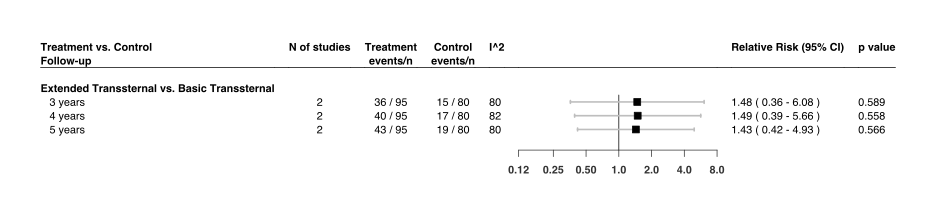
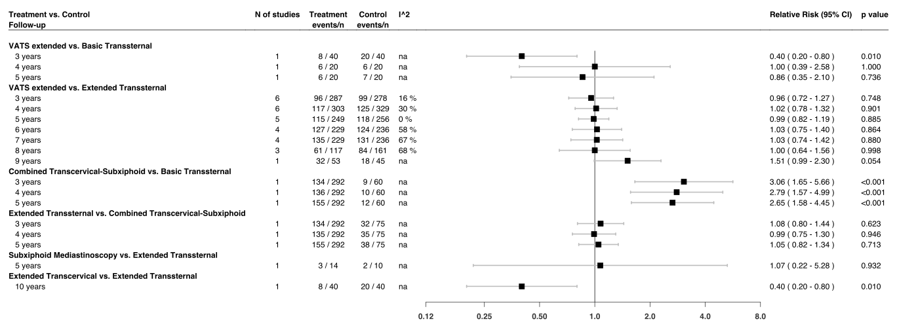

Thymectomy
================
Oscar Ponce & Andrea Solis-Pazmino
5/7/2020

## R Packages

`metafor`:[package](http://www.metafor-project.org/doku.php) used to
perform the analysis

`forestplot`:[package](https://cran.r-project.org/web/packages/forestplot/forestplot.pdf)
used to create forest plots

## Analysis codes

<details>

<summary>CLICK To View analysis codes</summary>

<p>

``` r
prema1 <- escalc(measure="RR",ai=events1, ci=events2, n1i=n1, n2i=n2,
                  subset=(followup==3 & comparison=="ETsT  vs.  STsT"), data=pao)
prema1 <- summary(prema1)
prema1$rr <- paste(formatC((exp(prema1$yi)), format='f', digits=2), " ",
                   "(", formatC((exp(prema1$ci.lb)), format='f', digits=2), "-",
                    formatC((exp(prema1$ci.ub)), format='f', digits=2),")")
ma1 <- rma(measure="RR", yi,vi, data=prema1, method="REML")
expma1 <- predict(ma1, transf = transf.exp.int)


prema2 <- escalc(measure="RR",ai=events1, ci=events2, n1i=n1, n2i=n2,
                  subset=(followup==4 & comparison=="ETsT  vs.  STsT"), data=pao)
prema2 <- summary(prema2)
prema2$rr <- paste(formatC((exp(prema2$yi)), format='f', digits=2), " ",
                   "(", formatC((exp(prema2$ci.lb)), format='f', digits=2), "-",
                    formatC((exp(prema2$ci.ub)), format='f', digits=2),")")
ma2 <- rma(measure="RR", yi,vi, data=prema2, method="REML")
expma2 <- predict(ma2, transf = transf.exp.int)


ma1 <- rma(measure="RR", ai=events1, ci=events2, n1i=n1, n2i=n2, 
           data=pao, subset=(followup==3 & comparison=="ETsT  vs.  STsT"), 
           method="REML")
expma1 <- predict(ma1, transf = exp, digits=2)

ma2 <- rma(measure="RR", ai=events1, ci=events2, n1i=n1, n2i=n2, 
           data=pao, subset=(followup==4 & comparison=="ETsT  vs.  STsT"), 
           method="REML")
expma2<- predict(ma2, transf = exp, digits=2)

ma3 <- rma(measure="RR", ai=events1, ci=events2, n1i=n1, n2i=n2, 
           data=pao, subset=(followup==5 & comparison=="ETsT  vs.  STsT"),
           method="REML")
expma3 <- predict(ma3, transf = exp, digits=2)


ma4 <- rma(measure="RR", ai=events1, ci=events2, n1i=n1, n2i=n2, 
           data=pao, subset=(followup==3 & comparison=="TcSxVT  vs.  STsT"),
           method="REML")
expma4 <- predict(ma4, transf = exp, digits=2)

ma5 <- rma(measure="RR", ai=events1, ci=events2, n1i=n1, n2i=n2, 
           data=pao, subset=(followup==4 & comparison=="TcSxVT  vs.  STsT"), 
           method="REML")
expma5 <- predict(ma5, transf = exp, digits=2)

ma6 <- rma(measure="RR", ai=events1, ci=events2, n1i=n1, n2i=n2, 
           data=pao, subset=(followup==5 & comparison=="TcSxVT  vs.  STsT"), 
           method="REML")
expma6 <-predict(ma6, transf = exp, digits=2)


ma7 <- rma(measure="RR", ai=events1, ci=events2, n1i=n1, n2i=n2, 
           data=pao, subset=(followup==3 & comparison=="ETsT  vs.  TcSxVT"),
           method="REML")
expma7 <- predict(ma7, transf = exp, digits=2)

ma8 <- rma(measure="RR", ai=events1, ci=events2, n1i=n1, n2i=n2, 
           data=pao, subset=(followup==4 & comparison=="ETsT  vs.  TcSxVT"), 
           method="REML")
expma8 <- predict(ma8, transf = exp, digits=2)

ma9 <- rma(measure="RR", ai=events1, ci=events2, n1i=n1, n2i=n2, 
           data=pao, subset=(followup==5 & comparison=="ETsT  vs.  TcSxVT"), 
           method="REML")
expma9 <- predict(ma9, transf = exp, digits=2)


ma10 <- rma(measure="RR", ai=events1, ci=events2, n1i=n1, n2i=n2, 
            data=pao, subset=(followup==10 & comparison=="ETsT  vs.  BTcT"),
            method="REML")
expma10 <- predict(ma10, transf = exp, digits=2)


ma11 <- rma(measure="RR", ai=events1, ci=events2, n1i=n1, n2i=n2, 
            data=pao, subset=(followup==5 & comparison=="IMT  vs.  ETsT"), 
            method="REML")
expma11 <- predict(ma11, transf = exp, digits=2)


ma12 <- rma(measure="RR", ai=events1, ci=events2, n1i=n1, n2i=n2, 
            data=pao, 
            subset=(followup==3 & comparison=="VATET bilateral  vs.  ETsT"), 
            method="REML")
expma12 <- predict(ma12, transf = exp, digits=2)

ma13 <- rma(measure="RR", ai=events1, ci=events2, n1i=n1, n2i=n2, 
            data=pao, 
            subset=(followup==4 & comparison=="VATET bilateral  vs.  ETsT"), 
            method="REML")
expma13 <- predict(ma13, transf = exp, digits=2)

ma14 <- rma(measure="RR", ai=events1, ci=events2, n1i=n1, n2i=n2, 
            data=pao, 
            subset=(followup==5 & comparison=="VATET bilateral  vs.  ETsT"), 
            method="REML")
expma14 <- predict(ma14, transf = exp, digits=2)

ma15 <- rma(measure="RR", ai=events1, ci=events2, n1i=n1, n2i=n2, data=pao, 
            subset=(followup==3 & comparison=="VATET unilateral  vs.  ETsT" &
                      group=="Overall"), method="REML")
expma15 <- predict(ma15, transf = exp, digits=2)

ma16 <- rma(measure="RR", ai=events1, ci=events2, n1i=n1, n2i=n2, data=pao, 
            subset=(followup==4 & comparison=="VATET unilateral  vs.  ETsT" &
                      group=="Overall"), method="REML")
expma16 <- predict(ma16, transf = exp, digits=2)

ma17 <- rma(measure="RR", ai=events1, ci=events2, n1i=n1, n2i=n2, data=pao, 
            subset=(followup==5 & comparison=="VATET unilateral  vs.  ETsT" &
                      group=="Overall"), method="REML")
expma17 <- predict(ma17, transf = exp, digits=2)

ma18 <- rma(measure="RR", ai=events1, ci=events2, n1i=n1, n2i=n2, data=pao, 
            subset=(followup==6 & comparison=="VATET unilateral  vs.  ETsT" &
                      group=="Overall"), method="REML")
expma18 <- predict(ma18, transf = exp, digits=2)

ma19 <- rma(measure="RR", ai=events1, ci=events2, n1i=n1, n2i=n2, data=pao, 
            subset=(followup==7 & comparison=="VATET unilateral  vs.  ETsT" &
                      group=="Overall"), method="REML")
expma19 <- predict(ma19, transf = exp, digits=2)

ma20 <- rma(measure="RR", ai=events1, ci=events2, n1i=n1, n2i=n2, data=pao, 
            subset=(followup==8 & comparison=="VATET unilateral  vs.  ETsT" &
                      group=="Overall"), method="REML")
expma20 <- predict(ma20, transf = exp, digits=2)


ma33 <- rma(measure="RR", ai=events1, ci=events2, n1i=n1, n2i=n2, 
            data=pao, subset=(followup==3 & 
                      comparison=="VATET unilateral  vs.  VATET bilateral"),
            method="REML")
expma33 <- predict(ma33, transf = exp, digits=2)

ma34 <- rma(measure="RR", ai=events1, ci=events2, n1i=n1, n2i=n2, 
            data=pao, subset=(followup==4 & 
                      comparison=="VATET unilateral  vs.  VATET bilateral"),
            method="REML")
expma34 <- predict(ma34, transf = exp, digits=2)

ma35 <- rma(measure="RR", ai=events1, ci=events2, n1i=n1, n2i=n2, 
            data=pao, subset=(followup==5 & 
                      comparison=="VATET unilateral  vs.  VATET bilateral"),
            method="REML")
expma35 <- predict(ma35, transf = exp, digits=2)

ma36 <- rma(measure="RR", ai=events1, ci=events2, n1i=n1, n2i=n2, 
            data=pao, subset=(followup==6 & 
                      comparison=="VATET unilateral  vs.  VATET bilateral"),
            method="REML")
expma36 <- predict(ma36, transf = exp, digits=2)


ma37 <- rma(measure="RR", ai=events1, ci=events2, n1i=n1, n2i=n2, 
            data=pao, subset=(followup==3 & 
                      comparison=="VATS unilateral  vs.  STsT"), 
            method="REML")
expma37 <- predict(ma37, transf = exp, digits=2)

ma38 <- rma(measure="RR", ai=events1, ci=events2, n1i=n1, n2i=n2, 
            data=pao, subset=(followup==4 & 
                      comparison=="VATS unilateral  vs.  STsT"), 
            method="REML")
expma38 <- predict(ma38, transf = exp, digits=2)

ma39 <- rma(measure="RR", ai=events1, ci=events2, n1i=n1, n2i=n2, 
            data=pao, subset=(followup==5 & 
                      comparison=="VATS unilateral  vs.  STsT"), 
            method="REML")
expma39 <- predict(ma39, transf = exp, digits=2)


prema40 <- escalc(measure="RR",ai=events1, ci=events2, n1i=n1, n2i=n2,
                  subset=(followup==3 & 
                            comparison=="VATS unilateral  vs.  ETsT"), data=pao)
prema40 <- summary(prema40)
prema40$rr <- paste(formatC((exp(prema40$yi)), format='f', digits=2), " ",
                   "(", formatC((exp(prema40$ci.lb)), format='f', digits=2), "-",
                    formatC((exp(prema40$ci.ub)), format='f', digits=2),")")
ma40 <- rma(measure="RR", yi,vi, data=prema40, method="REML")
expma40 <- predict(ma40, transf = transf.exp.int)


prema41 <- escalc(measure="RR",ai=events1, ci=events2, n1i=n1, n2i=n2,
                  subset=(followup==4 & 
                            comparison=="VATS unilateral  vs.  ETsT"), data=pao)
prema41 <- summary(prema41)
prema41$rr <- paste(formatC((exp(prema41$yi)), format='f', digits=2), " ",
                   "(", formatC((exp(prema41$ci.lb)), format='f', digits=2), "-",
                    formatC((exp(prema41$ci.ub)), format='f', digits=2),")")
ma41 <- rma(measure="RR", yi,vi, data=prema41, method="REML")
expma41 <- predict(ma41, transf = transf.exp.int)


prema42 <- escalc(measure="RR",ai=events1, ci=events2, n1i=n1, n2i=n2,
                  subset=(followup==5 & 
                            comparison=="VATS unilateral  vs.  ETsT"), data=pao)
prema42 <- summary(prema42)
prema42$rr <- paste(formatC((exp(prema42$yi)), format='f', digits=2), " ",
                   "(", formatC((exp(prema42$ci.lb)), format='f', digits=2), "-",
                    formatC((exp(prema42$ci.ub)), format='f', digits=2),")")
ma42 <- rma(measure="RR", yi,vi, data=prema42, method="REML")
expma42 <- predict(ma42, transf = transf.exp.int)


prema43 <- escalc(measure="RR",ai=events1, ci=events2, n1i=n1, n2i=n2,
                  subset=(followup==6 & 
                            comparison=="VATS unilateral  vs.  ETsT"), data=pao)
prema43 <- summary(prema43)
prema43$rr <- paste(formatC((exp(prema43$yi)), format='f', digits=2), " ",
                   "(", formatC((exp(prema43$ci.lb)), format='f', digits=2), "-",
                    formatC((exp(prema43$ci.ub)), format='f', digits=2),")")
ma43 <- rma(measure="RR", yi,vi, data=prema43, method="REML")
expma43 <- predict(ma43, transf = transf.exp.int)


prema44 <- escalc(measure="RR",ai=events1, ci=events2, n1i=n1, n2i=n2,
                  subset=(followup==7 & 
                            comparison=="VATS unilateral  vs.  ETsT"), data=pao)
prema44 <- summary(prema44)
prema44$rr <- paste(formatC((exp(prema44$yi)), format='f', digits=2), " ",
                   "(", formatC((exp(prema44$ci.lb)), format='f', digits=2), "-",
                    formatC((exp(prema44$ci.ub)), format='f', digits=2),")")
ma44 <- rma(measure="RR", yi,vi, data=prema44, method="REML")
expma44 <- predict(ma44, transf = transf.exp.int)

prema45 <- escalc(measure="RR",ai=events1, ci=events2, n1i=n1, n2i=n2,
                  subset=(followup==8 & 
                            comparison=="VATS unilateral  vs.  ETsT"), data=pao)
prema45 <- summary(prema45)
prema45$rr <- paste(formatC((exp(prema45$yi)), format='f', digits=2), " ",
                   "(", formatC((exp(prema45$ci.lb)), format='f', digits=2), "-",
                    formatC((exp(prema45$ci.ub)), format='f', digits=2),")")
ma45 <- rma(measure="RR", yi,vi, data=prema45, method="REML")
expma45 <- predict(ma45, transf = transf.exp.int)


ma46 <- rma(measure="RR", ai=events1, ci=events2, n1i=n1, n2i=n2, 
            data=pao, subset=(followup==9 & 
                      comparison=="VATS unilateral  vs.  ETsT"), method="REML")
expma46 <- predict(ma46, transf = exp, digits=2)


ma47 <- rma(measure="RR", ai=events1, ci=events2, n1i=n1, n2i=n2, 
            data=pao, subset=(followup==3 & comparison=="VATS left  vs.  VATS right"),
            method="REML")
expma47 <- predict(ma47, transf = exp, digits=2)

ma48 <- rma(measure="RR", ai=events1, ci=events2, n1i=n1, n2i=n2, 
            data=pao, subset=(followup==4 & comparison=="VATS left  vs.  VATS right"),
            method="REML")
expma48 <- predict(ma48, transf = exp, digits=2)

ma49 <- rma(measure="RR", ai=events1, ci=events2, n1i=n1, n2i=n2, 
            data=pao, subset=(followup==3 & 
            comparison=="VATS unilateral with robotic  vs.  VATS unilateral"),
            method="REML")
expma49 <- predict(ma49, transf = exp, digits=2)

ma50 <- rma(measure="RR", ai=events1, ci=events2, n1i=n1, n2i=n2, 
            data=pao, subset=(followup==5 & 
            comparison=="VATS unilateral with robotic  vs.  VATS unilateral"),
            method="REML")
expma50 <- predict(ma50, transf = exp, digits=2)
```

</p>

</details>

## Summary of forest plots

**Figure 1 - Summary of forest plots of the risk of achieving Complete
Stable Remission in patients with myasthenia gravis who underwent an
agressive surgery vs. those who underwent another aggresive surgery at
different follow-ups**
<!-- -->

**Figure 2 - Summary of forest plots of the risk of achieving Complete
Stable Remission in patients with myasthenia gravis who underwent a
less-aggresive surgery vs. those who underwent an aggresive surgery at
different follow-ups**
<!-- -->

**Figure 3 - Summary of forest plots of the risk of achieving Complete
Stable Remission in patients with myasthenia gravis who underwent a
less-aggresive surgery vs. those who underwent another less-aggressive
surgery at different follow-ups**
<!-- -->

## Individual forest plots

**Suppl Figure 1 - The risk of achieving Complete Stable Remission in
patients with myasthenia gravis who underwent VATS unilateral vs. those
who underwent ETsT at 3 years of follow-up**
<!-- -->

**Suppl Figure 2 - The risk of achieving Complete Stable Remission in
patients with myasthenia gravis who underwent VATS unilateral vs. those
who underwent ETsT at 4 years of follow-up**
<!-- -->

**Suppl Figure 3 - The risk of achieving Complete Stable Remission in
patients with myasthenia gravis who underwent VATS unilateral vs. those
who underwent ETsT at 5 years of follow-up**
<!-- -->

**Suppl Figure 4 - The risk of achieving Complete Stable Remission in
patients with myasthenia gravis who underwent VATS unilateral vs. those
who underwent ETsT at 6 years of follow-up**
<!-- -->

**Suppl Figure 5 - The risk of achieving Complete Stable Remission in
patients with myasthenia gravis who underwent VATS unilateral vs. those
who underwent ETsT at 7 years of follow-up**
<!-- -->

**Suppl Figure 6 - The risk of achieving Complete Stable Remission in
patients with myasthenia gravis who underwent VATS unilateral vs. those
who underwent ETsT at 8 years of follow-up**
<!-- -->
